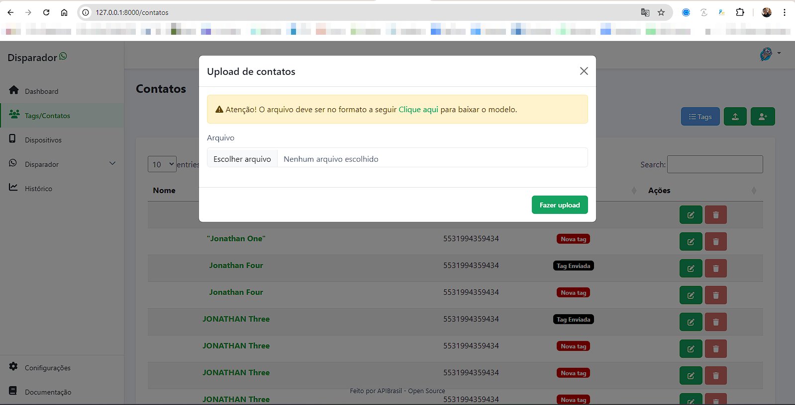
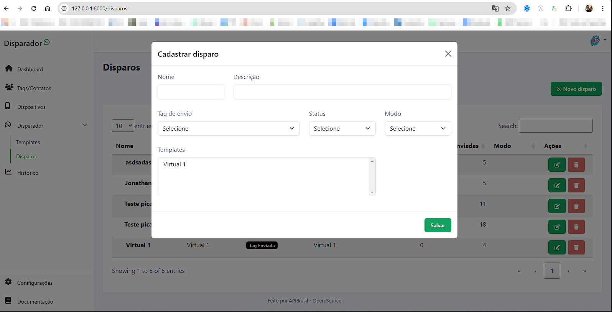
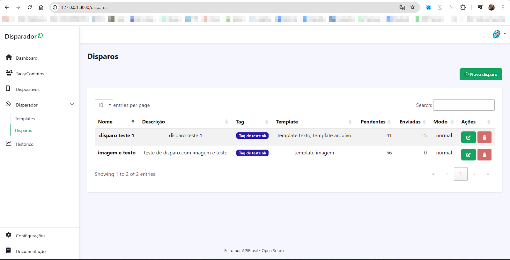
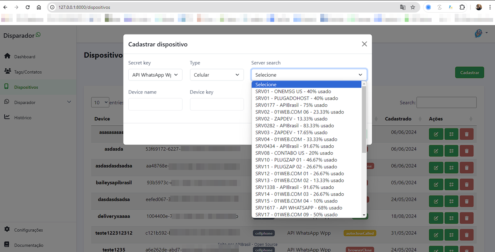
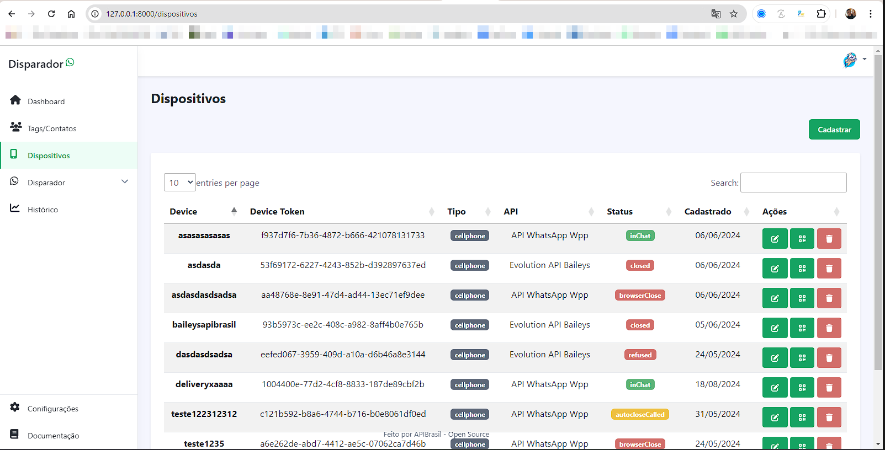
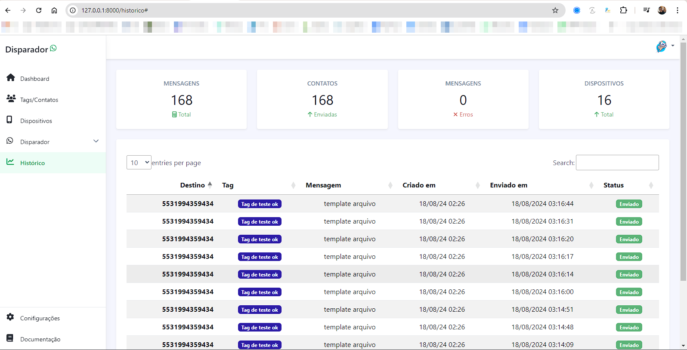

# Disparador Open Source

A ideia desse software, é servir como base para outros programadores implementarem suas integrações com o WhatsApp 

### Requisitos
Você irá precisar de uma conta com um plano ativo na plataforma APIBrasil para utilizar e cadastrar os dispostivos

### Veja algumas etapas

Esse é o roadmap planejado para a plataforma 

| Status  | Tarefa                                   |
| ------- | --------                                 |
| OK   |   Login                                     |   
| OK   |   Importação de contatos csv                |   
| OK   |   Importação de contatos grupos             |   
| OK   |   Criar templates (texto/arquivos/imagens)  |   
| OK   |   Editar templates                          |   
| OK   |   Deletar templates                         |
| OK   |   Criar dispositivo                         |   
| OK   |   Editar dispositivo                        |   
| OK   |   Deletar dispositivo                       |
| OK   |   Envia Texto, Imagens e arquivos           |
| OK   |   Criar usuário                             |   
| Em andamento   |   Editar usuário                  |   
| Em andamento   |   Deletar usuário                 |   
-----------------------------------------------------

### Vincular usuário
php artisan db:seed:createFirstUser --email="email_apibrasil@email.com" --senha="sua_senha_apibrasil"

### API Local
http://127.0.0.1:8000/api/sendText?token=1234&number=5531994359434&text=Enviado%20via%20API

### Screenshots
Dashboard

Uploads de contatos

Novo de disparo

Disparando

Novo dispositivo

Dispositivo

Historico

