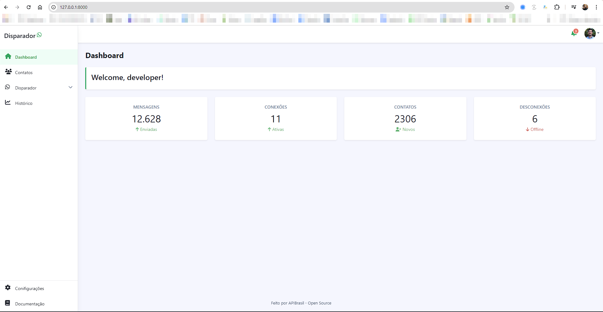
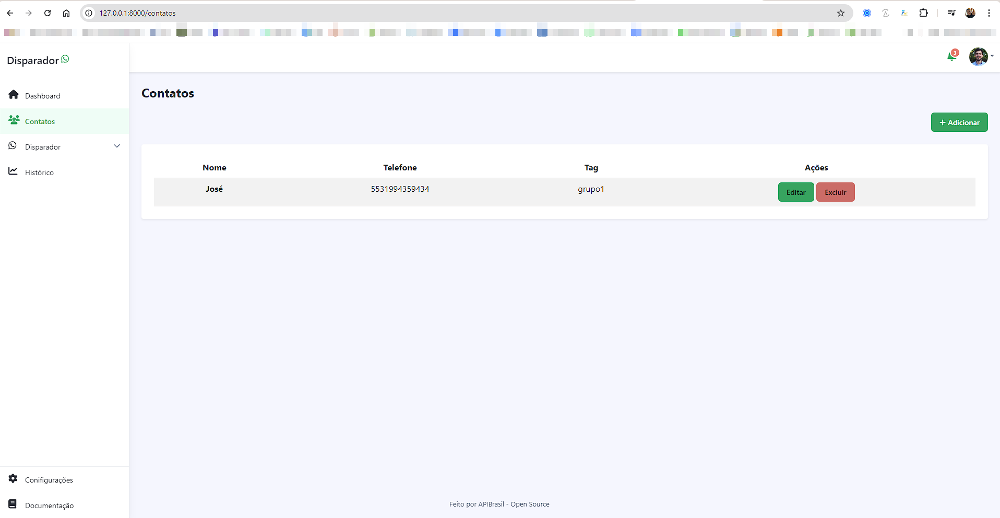
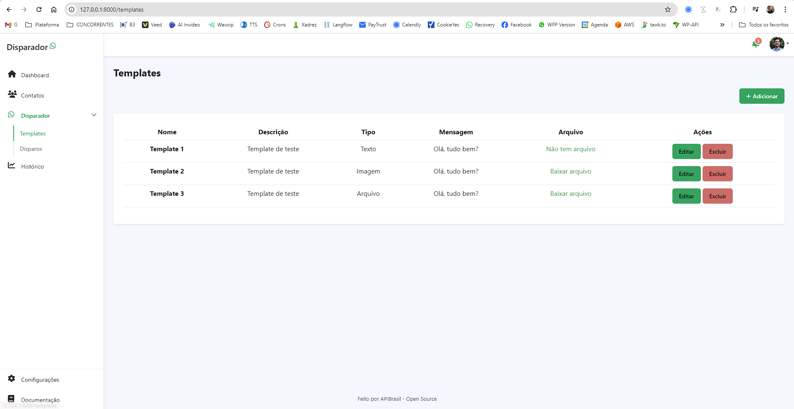

# Disparador Open Source

A ideia desse software, é servir como base para outros programadores implementarem suas integrações com o WhatsApp 

### Veja algumas etapas

Esse é o roadmap planejado para a plataforma 

| Status  | Tarefa                                      |
| ------- | --------                                    |
| Em andamento   |   Login                                     |   
| Em andamento   |   Importação de contatos excel              |   
| Em andamento   |   Importação de contatos grupos             |   
| Em andamento   |   Criar templates (texto/arquivos/imagens)  |   
| Em andamento   |   Editar templates                          |   
| Em andamento   |   Deletar templates                         |
| Em andamento   |   Criar dispositivo                         |   
| Em andamento   |   Editar dispositivo                        |   
| Em andamento   |   Deletar dispositivo                       |   
| Em andamento   |   Criar usuário                             |   
| Em andamento   |   Editar usuário                            |   
| Em andamento   |   Deletar usuário                           |   

-------------------------------

### Screenshots
Dashboard

Contatos

Disparador
